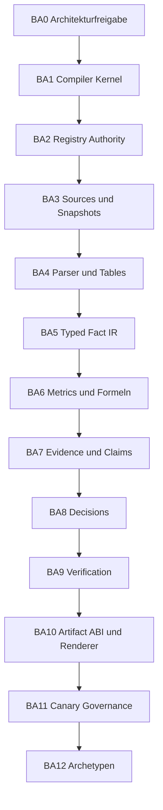

# Room16 Financial Research Compiler

## Endgültiger Architektur- und Migrationsentwurf vor Implementierungsfreigabe

Status: `operator_gated_architecture_candidate`  
Datum: `2026-08-14`  
Implementierung: `nicht begonnen`  
Freigabegrenze: Kein Compiler-Bauabschnitt startet ohne ausdrückliche Freigabe des Operators.

## 1. Executive Summary

Room16 wird als deterministischer Financial Research Compiler geführt. Ein Bericht ist nur noch ein mögliches Ausgabeformat. Das eigentliche Produkt ist eine reproduzierbare Übersetzung von eingefrorenen Quellen in typisierte, belegte und verifizierte finanzielle Aussagen und Entscheidungen.

Die bestehende Arbeit wird nicht verworfen. Der aktuelle Research-Kern ist bereits ungefähr die Hälfte des Weges: Er besitzt offizielle Datenadapter, unveränderliche Source Snapshots, deterministische Berechnungen, Fact- und Evidence-Ledger, semantische Gates, ein Decision Packet, das hashgebundene Authority Bundle sowie die akzeptierte WM/COST/ABT-Canary-Baseline. Der notwendige Umbau ist deshalb kein Neubau, sondern eine Entflechtung und Formalisierung.

Die zentrale Abweichung lautet: Das heutige System verhält sich in vielen Teilen wie ein Compiler, ist aber nicht als Compiler organisiert. Pass-Grenzen, Intermediate Representations, Registry-Eigentümerschaft, Diagnostik, Versionierung und Migration sind teils implizit, verteilt oder doppelt implementiert. Der derzeitige Hauptlauf verbindet Parsing, Normalisierung, Berechnung, Claims, Berichtsbau, Audit und Release-Artefakte in großen Modulen. Dadurch konnten bisher generische Fehler behoben werden, aber neue Fehlerklassen waren oft erst im fertigen Bericht sichtbar.

Die Zielarchitektur führt zwölf verbindliche Compiler-Layer, versionierte Intermediate Representations, ein gemeinsames Pass-Protokoll und eine einzige Registry-Autorität ein. Das bestehende `room16.research_authority_bundle@3` bleibt während der Migration die stabile äußere ABI. Erst wenn alle Consumer denselben neuen Contract nachweislich lesen, darf ein späteres Authority-Bundle v4 erwogen werden.

> Architektururteil: `fit_reviewed_adopted_as_target_architecture_operator_gated`

Das Masterpack setzt die richtige Richtung, ist selbst aber nur ein Entwurf. Es nennt Pipeline, Registries, Typen und Entwicklungsregel, definiert jedoch keine vollständigen Schnittstellen. Die vorliegende Roadmap ergänzt genau diese fehlenden Contracts, Migrationen, Tests und Canary-Grenzen.

## 2. Operator-Zielbild

Der Operator startet eine Analyse mit Instrument und Stichtag. Room16 erzeugt daraufhin einen unveränderlichen Compile Run mit diesen Eigenschaften:

1. Jede verwendete Source ist physisch eingefroren und gehasht.
2. Jeder Parser erzeugt strukturierte Daten mit Source Locator statt Berichtstext.
3. Tabellen bleiben als Tabellen mit Zeilen-, Spalten-, Perioden- und Einheitenachsen erhalten.
4. Jede Zahl wird vor jeder Claim- oder Reportbildung typisiert.
5. Formeln, Perioden, Einheiten und Reconciliation sind reproduzierbar.
6. Claims referenzieren ausschließlich bestehende Fact- und Evidence-IDs.
7. Entscheidungen referenzieren ausschließlich bestehende Claims, Facts, Regeln und Risiken.
8. Verifier geben stabile Diagnosecodes mit Record- und Source-Bezug aus.
9. Ein fehlgeschlagener Pass stoppt nachfolgende Passes fail-closed.
10. Renderer dürfen keine neue finanzielle Wahrheit erzeugen.
11. Ein optionales LLM darf nur eine freigegebene Claim-/Decision-Struktur formulieren oder abwägen; es darf keine Fakten, Kennzahlen, Quellen oder Ratingrechte hinzufügen.
12. Release- und Publish-Gates bleiben vom Compiler-Erfolg getrennt.

Der sichtbare Standardoutput ist eine kompakte Compile Summary mit Status, Stichtag, Quellenabdeckung, offenen Diagnosen, Entscheidungskorridor und verfügbaren Artefakten. PDF, DOCX, Markdown, JSON, interne Dossiers und spätere öffentliche Fassungen sind Backends desselben Compile Runs.

## 3. Systemgrenze und Ownership

### 3.1 Compiler Core

Owner: `research-agent-ops`

Der Core besitzt:

- Source Acquisition und Snapshots,
- Parser und Table Discovery,
- Normalisierung und Reconciliation,
- Type System, Metric Registry und Formula Registry,
- Typed Facts, Evidence Graph, Claim Graph und Decision Graph,
- Verification, Diagnostics und Compile Verdict,
- das kanonische Authority-/Compiler-Artefakt.

### 3.2 Product Shell

Owner: `company-dossier-lab`

Die Produktschicht besitzt:

- Eingabe, Resolver und Capability-Anzeige,
- Queue, Runtime und lokale App,
- optionales authority-gebundenes LLM-Rendering,
- deterministische Dokument-Renderer,
- Human Review, Public/Legal, Paid und Customer Delivery,
- Release Candidate Packaging und Operator-Gates.

Sie darf keine zweite Metric-, Fact-, Evidence-, Claim- oder Decision-Wahrheit führen.

### 3.3 Harte Außengrenzen

Nicht Teil des Compilers sind:

- Trading-, Portfolio-, Positionsgrößen- oder Kauf-/Verkaufsanweisungen,
- rechtliche, redaktionelle oder öffentliche Freigabe,
- Payment, Checkout, Kundenzugang und Distribution,
- automatischer Providerkauf,
- ein LLM als Daten-, Berechnungs- oder Entscheidungsautorität.

## 4. Zielpipeline

```mermaid
flowchart LR
    A[Compile Request] --> B[Source Acquisition]
    B --> C[Source Snapshot IR]
    C --> D[Parser und Table Discovery]
    D --> E[Parsed Document und Canonical Table IR]
    E --> F[Normalizer und Reconciliation]
    F --> G[Typed Fact und Metric IR]
    G --> H[Formula Evaluation]
    H --> I[Evidence Graph]
    I --> J[Claim Graph]
    J --> K[Decision Graph]
    K --> L[Verification und Diagnostics]
    L --> M[Compiler Artifact Bundle]
    M --> N[Deterministic Renderer]
    M --> O[Optional Authority-bound LLM Renderer]
    N --> P[Review und Release Gates]
    O --> P
```

### 4.1 Die zwölf Compiler-Layer

| Layer | Name | Aufgabe | Kanonischer Output |
| --- | --- | --- | --- |
| L0 | Compile Intake | Instrument, Stichtag, Policy und Capability eindeutig einfrieren | `CompileRequestIR` |
| L1 | Source Acquisition | autoritative Quellen auswählen und abrufen | `SourceAcquisitionIR` |
| L2 | Source Snapshot | unveränderliche Source Bytes, Hashes und Dispositionen binden | `SourceSnapshotIR` |
| L3 | Parse and Discover | Dokumentstruktur, Tabellen, Blöcke und Locators erfassen | `ParsedDocumentIR`, `CanonicalTableIR` |
| L4 | Normalize and Reconcile | Begriffe, Perioden, Einheiten, Restatements und Duplikate auflösen | `NormalizedRecordIR` |
| L5 | Typed Facts | Zahlen und qualitative Fakten strikt typisieren | `TypedFactIR` |
| L6 | Metric and Formula Evaluation | Kennzahlen und Ableitungen deterministisch berechnen | `MetricIR`, `FormulaEvaluationIR` |
| L7 | Evidence Graph | Facts, Quellen, Snapshots, Tabellenzellen und Ableitungen verbinden | `EvidenceGraphIR` |
| L8 | Claim Graph | zulässige Aussagen aus bestehenden Facts und Evidence bilden | `ClaimGraphIR` |
| L9 | Decision Graph | Ratingkorridor, Risiken, Gegenpositionen und Schlussfolgerungen ableiten | `DecisionGraphIR` |
| L10 | Verification | alle Contract-, Semantik-, Coverage- und Release-Invarianten prüfen | `DiagnosticIR`, `CompileVerdictIR` |
| L11 | Emit | kanonisches, hashgebundenes Compiler-Artefakt ausgeben | `CompilerArtifactBundle` |

Renderer und Release Governance sind nachgelagerte Backends beziehungsweise Kontrollflächen. Sie sind nicht berechtigt, Compiler-Wahrheit zu verändern.

## 5. Verbindlicher Pass-Contract

Jeder Compiler-Pass besitzt denselben Envelope:

- `pass_id` und `pass_version`,
- akzeptierte Input-IRs mit Contract-Versionen,
- erzeugte Output-IRs mit Contract-Versionen,
- Registry- und Policy-Hashes,
- deterministische Konfiguration,
- Source-/Input-Hashes,
- Start-/Endzustand ohne semantische Zeitabhängigkeit,
- stabile Diagnosecodes,
- `pass | fail | skipped_due_to_upstream_failure`,
- blockierende und nicht blockierende Diagnosen,
- Output-Hashes,
- Reproduzierbarkeits- und Cache-Key,
- Implementierungs-Commit und Compiler-Version.

Kein Pass darf einen fehlenden Wert als Null materialisieren, einen unbekannten Typ still zuordnen, einen nicht auflösbaren Source Locator verwerfen oder einen blockierenden Upstream-Fehler übergehen.

## 6. Intermediate Representations

### 6.1 CompileRequestIR

Enthält Instrumentidentität, Börsenplatz, Jurisdiktion, Stichtag, gewünschte Policy, zulässige Provider, Kostenfreigabe und Output-Backends. Die Identität wird vor dem ersten Abruf eingefroren.

### 6.2 SourceSnapshotIR

Übernimmt die bewährten Source-Snapshot-v4-Regeln: physische Bytes, SHA-256, Größe, Media Type, Retrieval-/Publication-/Filing-Zeit, Source ID, Parser- und Codeversion sowie explizite Disposition.

### 6.3 ParsedDocumentIR

Enthält Dokumentblöcke, Heading-Hierarchie, Tabellenreferenzen, Textspans, Source Locator, Dokumentrolle und Parserdiagnosen. Es enthält noch keine finanzielle Interpretation.

### 6.4 CanonicalTableIR

Erhält Titel, Headerzeilen, Zeilen- und Spaltenachsen, Perioden-, Metric-, Unit-, Currency- und Comparison-Achsen sowie jede Zelle mit stabiler ID und Locator. Transponierte, sparse und mehrstufige Tabellen bleiben strukturell unterscheidbar.

### 6.5 NormalizedRecordIR

Bindet Rohwerte an kanonische Begriffe, Perioden, Einheiten, Vorzeichen, Scale und Basis. Unresolved, ambiguous, quarantined und rejected bleiben eigene Zustände.

### 6.6 TypedFactIR

Jeder Fact besitzt mindestens Fact ID, Metric ID, Fact Type, Value State, Wert oder Range, Einheit, Währung, Periodenart, exakte Periodengrenzen, Presentation Basis, Direction, Impact, Source-/Evidence-/Table-/Cell-IDs und Confidence. `zero`, `missing`, `not_applicable`, `not_disclosed` und `not_retrieved` sind strukturell verschieden.

### 6.7 MetricIR und FormulaEvaluationIR

Eine Metric Definition besitzt Dimensions-, Unit-, Perioden-, Aggregations- und Evidence-Regeln. Eine Berechnung referenziert Formula ID, Operanden-Fact-IDs, Zwischenergebnisse, Rundung, Ergebnisdimension und alle Diagnosen. Keine Formel wird in Berichtscode dupliziert.

### 6.8 EvidenceGraphIR

Gerichteter Graph aus Source Snapshot, Source Record, Table, Cell, Parsed Record, Fact, Formula und Claim. Jede Kante hat einen Typ und ist prüfbar. Eine URL ohne Snapshot ist keine Evidence.

### 6.9 ClaimGraphIR

Ein Claim referenziert Fact- und Evidence-IDs, Scope, Aussageart, Materialität, Unsicherheit, erlaubte Renderer und sichtbare Citation. Claims besitzen keine freien neuen Zahlen.

### 6.10 DecisionGraphIR

Ein Decision Node referenziert Claims, Facts, Regeln, Risiken, Gegenpositionen und Permission Corridor. Der Graph unterscheidet analytisches Urteil, Timing Overlay, Datenlimitation und Publish Permission.

### 6.11 DiagnosticIR

Jede Diagnose besitzt stabilen Code, Layer, Pass, Severity, Blocking-Status, Contract-Version, Record IDs, Source Locator, menschliche Erklärung, erwartete Korrekturklasse und zugehörige Negative-Fixture-ID.

### 6.12 CompilerArtifactBundle

Während der Migration ergänzt ein `room16.compiler_manifest@1` das bestehende `room16.research_authority_bundle@3`. Es bindet Pass-Manifest, IR-Hashes, Registry Lock, Diagnostics, Compile Verdict und die v3-Ausgabe. Ein Breaking Change an der äußeren Authority-ABI ist in dieser Roadmap nicht freigegeben.

## 7. Registry-Modell

Eine Registry ist versionierte ausführbare Policy, keine lose Python-Konstante und keine Dokumentationstabelle.

| Registry | Eigentümer | Mindestinhalt |
| --- | --- | --- |
| Source Adapter Registry | Research | Jurisdiktion, Source-Klasse, Authority, Capability, Kostenklasse |
| Parser Registry | Research | Dokumentklasse, Media Type, Parser, Version, unterstützte Strukturen |
| Table Registry | Research | Table Semantic Type, Achsenvertrag, erlaubte Zellrollen |
| Metric Registry | Research | Metric ID, Dimension, Units, Perioden, Aggregation, Evidence, Formeln |
| Fact Type Registry | Research | Fact Type, Value State, Perioden-/Unit-/Direction-Regeln |
| Formula Registry | Research | Formula ID, Operandenrollen, Dimensionen, Rundung, Version |
| Evidence Policy Registry | Research | Source Tier, Snapshot-Pflicht, zulässige Kanten und Coverage |
| Claim Registry | Research | Claim Type, erforderliche Facts/Evidence, Unsicherheit, Rendererfreigabe |
| Decision Registry | Research | Rule ID, Inputs, Permission-Wirkung, Risiken, Priorität |
| Diagnostic Registry | Research | Code, Layer, Severity, Blocking Default, Fixture-Anforderung |
| Renderer Registry | Product | Backend, akzeptierter Bundle-Contract, erlaubte Sichtbarkeit |
| Canary/Archetype Registry | Product | eingefrorene Canaries, Dev/Holdout, erwartete Hash-/Semantikregeln |
| Release Registry | Product | Compiler-/Registry-Lock, Reviewzustand, offene Gates, Freigabestatus |

Die Research-Registries sind alleinige fachliche Autorität. Produktcode darf sie nur konsumieren oder gegen einen gebundenen Export verifizieren.

## 8. Was vom heutigen System erhalten bleibt

- SEC-, Nasdaq-, BSE- und optionale Provideradapter.
- Fail-closed Unsupported-Market-Verhalten.
- `room16.source_snapshot_manifest@4` als Basis für L2.
- Missingness-, Perioden-, Scale-, Direction-, Impact- und Tabellenhärtungen.
- deterministische Fundamentals-, Technical-, Valuation- und Risk-Berechnung.
- Fact Ledger v5 als Migrationsquelle für `TypedFactIR`.
- Evidence Ledger und Claim-Evidence-Coverage als Migrationsquelle für den Evidence Graph.
- Decision Packet und Rating Permission als Migrationsquelle für den Decision Graph.
- `room16.research_authority_bundle@3` als stabile Übergangs-ABI.
- deterministische Markdown/DOCX/PDF-Ausgabe und Renderparität.
- optionale `room16.authority_interpretation@1` unter der festen Truth Boundary.
- WM, COST und ABT als unveränderte akzeptierte Canary-Baseline.
- getrennte Human-, Legal-, Public-, Paid- und Operator-Gates.

## 9. Vollständige Ist-/Soll-Abweichungsmatrix

| ID | Ist-Zustand | Soll-Zustand | Root Cause | Priorität |
| --- | --- | --- | --- | --- |
| GAP-01 | Room16 ist in Doku und Dateinamen noch reportzentriert | Compiler ist Produkt; Reports sind Backends | historische Produktentwicklung vom sichtbaren Bericht aus | hoch |
| GAP-02 | `run_pipeline.py` und Current Runner orchestrieren viele Stufen monolithisch | explizite Pass-Pipeline mit stabilen Inputs/Outputs | Härtungen wurden in laufenden Hauptpfad integriert | sehr hoch |
| GAP-03 | keine gemeinsame IR-Spine zwischen allen Stufen | versionierte IR-Kette von Request bis Verdict | Modelle entstanden pro Fehlerklasse statt aus Gesamtvertrag | sehr hoch |
| GAP-04 | CanonicalMetric, EvidenceItem, OperatingKpiEvidence, TableCell und Fact-Ledger-Dicts überlappen | ein Typed-Fact-Modell mit kontrollierten Views | schrittweise Härtung ohne frühere Typautorität | sehr hoch |
| GAP-05 | Research Metric Registry enthält nur wenige explizite Definitionen und akzeptiert sonst freie semantische IDs | geschlossene, versionierte Metric Registry mit Unknown/Unresolved | permissiver Kompatibilitätsfallback | sehr hoch |
| GAP-06 | Produkt führt zusätzlich drei eigene Metric Definitions | Produkt konsumiert Research Registry Export | frühere Core-v2-Schiene blieb neben neuem Research-Kern liegen | hoch |
| GAP-07 | kein Table Registry Contract; Table Discovery steckt in Parsern | eigener Discovery-Pass plus Table Registry | Tabellenprobleme wurden parsernah einzeln gehärtet | sehr hoch |
| GAP-08 | Fact-Typisierung wird teilweise aus Evidence/Metric-Namen inferiert und Fact Ledger entsteht nach Claim-Generierung | Facts werden vor Claims vollständig typisiert | reportorientierte Reihenfolge | sehr hoch |
| GAP-09 | Evidence Ledger ist stark, aber monolithisch und nicht als versionierter Graph-Contract definiert | Evidence Graph IR plus Policy Registry | Funktionalität wuchs in einem großen Builder | hoch |
| GAP-10 | Claims sind deterministisch, aber ohne vollständige Claim Registry; Fact Ledger wird aus Claim-Nutzung gebaut | Claims konsumieren vorhandene Facts, nicht umgekehrt | Sichtbarkeitslogik steuerte Faktenauswahl | sehr hoch |
| GAP-11 | Decision Packet ist ein Ergebnisobjekt, aber kein prüfbarer Decision Graph | Nodes und Kanten für Regeln, Gründe, Risiken und Permissions | Decision Lineage wurde später ergänzt | hoch |
| GAP-12 | Validierung ist auf viele Module, Reports und Release-Skripte verteilt | ein Diagnostic Contract und ein deterministischer Verification Plan | neue Gates wurden je Finding ergänzt | sehr hoch |
| GAP-13 | Pydantic-Modelle sind häufig der einzige Schema-Contract; einige Produkt-JSON-Schemas sind ungenutzt oder veraltet | generierte/validierte JSON Schemas je öffentlicher IR | keine zentrale Contract Toolchain | hoch |
| GAP-14 | Authority Bundle v3 bindet Endartefakte, aber nicht jede Pass-Ausführung und Registry | Compiler Manifest bindet Pass- und Registry-Provenienz | Bundle wurde als Handoff, nicht als Compiler Record gebaut | hoch |
| GAP-15 | Authority-Verifikation existiert unabhängig in Research Python, Product Python und App JavaScript | eine Spezifikation plus Conformance Corpus; möglichst ein Validator-Owner | Cross-Language-Nachbau für App-Komfort | hoch |
| GAP-16 | Research und Product enthalten Berichtskomposition, QA und Rendererlogik | Renderer sind reine Backends über freigegebene IRs | historische TradingAgents-/Reportgenerator-Herkunft | hoch |
| GAP-17 | WM/COST/ABT und Finding-IDs stehen teils als Codekonstanten | Canary Registry mit gebundenem Freeze Record | schneller Abschluss des konkreten Cross-Company-Blocks | mittel |
| GAP-18 | Archetypprüfungen existieren, aber kein verbindlicher Dev-/Holdout-Lebenszyklus | Archetype Registry und Freeze Contract | Archetypen waren Qualitätsfälle, nicht Compiler-Releases | hoch |
| GAP-19 | Paketabhängigkeiten enthalten Zyklen zwischen Research Core, Evidence, Quality, Content und Decision | gerichtete Layer-Abhängigkeiten | inkrementelle Module ohne Enforcer | hoch |
| GAP-20 | Testzahl ist hoch, aber nicht jede Regel ist Contract-, Pass- und Fixture-gebunden | Coverage Matrix je Contract/Pass/Diagnostic | Regressionen wurden aus Findings statt aus Architektur abgeleitet | hoch |
| GAP-21 | Legacy- und neue Report-/Commerce-Surfaces liegen im selben Produktrepo | klare Namespace- und Runtime-Grenze, keine fachliche Entfernung im Compiler-Schnitt | Fork-Historie und Produktaufbau | mittel |
| GAP-22 | Compiler-Version heißt intern noch `research_agent_v0.1.0`; Repo-/Produktversionen sind nicht als ein Compiler Lock modelliert | ein semantischer Compiler/Registry/ABI-Lock | getrennte Versionshistorien | hoch |

## 10. Architekturprinzipien für die Migration

1. Kein Big-Bang-Rewrite.
2. Bestehende Canary-Archive bleiben bytegenau unverändert.
3. Authority Bundle v3 bleibt zunächst die äußere ABI.
4. Jeder neue Pass läuft zuerst im Shadow Mode gegen denselben eingefrorenen Input.
5. Alte und neue Outputs werden semantisch und nicht nur textuell verglichen.
6. Eine Registry hat genau einen Owner; Spiegel sind generiert und hashgebunden.
7. Kein Kompatibilitätsfallback darf unbekannte Metrics oder Fact Types als gültig erklären.
8. Keine neue Firma vor grünem Bauabschnitt und Canary-Lauf.
9. Neue Human-Prüfung nur bei bestehendem Rereview-Trigger, insbesondere Parser-/Tabellen-, Schema-, Registry-, Numeric-, Decision- oder Release-Gate-Bruch.
10. Berichtsdarstellung und öffentliche Freigabe bleiben außerhalb des Compile Verdicts.

## 11. Testarchitektur

Jeder Bauabschnitt nutzt dieselben Testfamilien, soweit anwendbar:

- Schema- und Contract-Tests.
- Negative Fixture: der historische oder synthetische Fehler muss reproduzierbar rot sein.
- Corrected Fixture: dieselbe Fehlerklasse muss nach der generischen Korrektur grün sein.
- Pass-Level Unit Tests ohne Renderer oder LLM.
- Property-/Metamorphic Tests für Scale, Reihenfolge, Tabellenrotation, Duplikate, Missingness und Perioden.
- Differential Tests zwischen aktuellem Pfad und neuem Compilerpfad.
- Cross-Language Conformance Corpus für Python/JavaScript-Consumer.
- vollständiger historischer Authority-/Packet-Replay.
- WM/COST/ABT Canary Regression auf gebundenem Freeze.
- Development/Holdout-Archetyp-Prüfung.
- Tamper-, Path-, Hash-, Identity- und Version-Mismatch-Tests.
- Determinismus: gleiche Inputs und Locks erzeugen gleiche IR- und Bundle-Hashes.
- Renderer-Parität und sichtbare Numeric-/Table-/Claim-Evidence-Coverage.
- Release-Gate-Reintroduction: erneutes Einführen eines Findings muss blockieren.

Grüne Tests allein erteilen keine Releasefreigabe. Der Compile Verdict, Canary-Status und gegebenenfalls Human Review müssen getrennt bestehen.

## 12. Compiler-Bauabschnitte

### BA0 - Architektur-Freeze und Baseline-Inventar

**Ziel**  
Die Zielarchitektur, Layer, Ownership, IRs, Registries, Migrationsgrenze und Freigaberegel verbindlich festlegen.

**Betroffene Compiler-Layer**  
Alle; keine Runtime-Änderung.

**Root Cause**  
Das Masterpack formuliert Richtung und Prinzipien, aber keine ausführbaren Schnittstellen oder Übergangsarchitektur.

**Risiken**  
Begriffswechsel ohne technische Wirkung; zu breite Neuarchitektur; unbeabsichtigtes Überschreiben bewährter Rails.

**Reihenfolge**  
Erster und allein zulässiger Abschnitt vor Operatorfreigabe.

**Benötigte Contracts**  
Compiler Constitution, Layer Map, Ownership Matrix, Versioning Policy, Migration Policy, Canary Policy.

**Benötigte Tests**  
Dokumentvollständigkeit, Link-/Schema-Prüfung der Roadmap, Code-zu-Architektur-Coverage-Matrix.

**Canary-Auswirkungen**  
Keine. Freeze und Candidate-Hashes werden nur referenziert.

**Definition of Done**  
Der Operator hat diese Architektur ausdrücklich freigegeben; alle späteren Bauabschnitte bleiben bis dahin `not_started`.

### BA1 - Compiler Kernel, Pass Protocol und Diagnostics

**Ziel**  
Ein kleiner Kernel orchestriert Passes, Status, Hashes, deterministische Konfiguration und Diagnosen, zunächst ohne fachliche Logik zu verschieben.

**Betroffene Compiler-Layer**  
L0 bis L11 als Steuerungsebene.

**Root Cause**  
Orchestrierung und Fehlerbehandlung sind aktuell in Hauptläufen und Einzelgates verteilt.

**Risiken**  
Ein zweiter Orchestrator; versteckte Seiteneffekte; falsche Cache-Wiederverwendung; Diagnosecodes ohne reale Blockwirkung.

**Reihenfolge**  
Nach BA0, vor jeder Fachmigration.

**Benötigte Contracts**  
`CompileRequestIR@1`, `PassManifest@1`, `DiagnosticIR@1`, `CompileVerdictIR@1`, `CompilerManifest@1`.

**Benötigte Tests**  
Pass-Reihenfolge, Upstream-Failure-Skip, Hashstabilität, Cache-Key, unbekannte Version, Exception-zu-Diagnostic, reproduzierbarer Shadow Run.

**Canary-Auswirkungen**  
Shadow-only. Bestehende WM/COST/ABT-Ausgabe darf sich nicht ändern.

**Definition of Done**  
Ein heutiger Canary-Lauf kann ohne fachliche Änderung als vollständig gebundene Pass-Kette protokolliert werden; alte Runtime bleibt führend.

### BA2 - Registry Authority und Type-System-Freeze

**Ziel**  
Alle fachlichen Definitionen erhalten einen Research-Owner, Version, Schema, Hash und kontrollierte Evolution.

**Betroffene Compiler-Layer**  
L1 bis L10.

**Root Cause**  
Registries sind unvollständig, implizit, permissiv oder zwischen Repositories dupliziert.

**Risiken**  
Breaking Changes an historischen Metrics; Registry-Dual-Truth; zu große erste Registry; still akzeptierte Unknowns.

**Reihenfolge**  
Nach BA1; Voraussetzung für BA3 bis BA9.

**Benötigte Contracts**  
Registry Envelope, Metric-, Fact-Type-, Formula-, Evidence-, Claim-, Decision- und Diagnostic-Registry-Schemas; Compatibility Policy.

**Benötigte Tests**  
Schema, Unique IDs, referenzielle Integrität, Unknown/Unresolved fail-closed, Dimensions-/Unit-/Perioden-Matrix, Registry-Diff-Klassifikation, generierter Product-Mirror-Hash.

**Canary-Auswirkungen**  
`metric_registry_breaking_change` ist bestehender Human-Rereview-Trigger. Zunächst nur Shadow-Diff; Freeze bleibt unverändert.

**Definition of Done**  
Jede in den drei Canaries verwendete Metric, Fact Type, Formula, Claim- und Decision-Regel ist registriert; Produkt besitzt keine handgepflegte Parallelwahrheit.

### BA3 - Source Acquisition und Snapshot Front-End

**Ziel**  
Resolver-Ausgabe, Market Capability, Adapterwahl, Abruf und Source Snapshot als explizite Compiler-Passes führen.

**Betroffene Compiler-Layer**  
L0 bis L2.

**Root Cause**  
Intake liegt im Produkt, Adapter im Research-Kern und Snapshotbildung später im Pipeline-Lauf; der vollständige Front-End-Plan ist nicht als ein Contract gebunden.

**Risiken**  
Look-ahead, Provider-Fallback, Stichtagsdrift, Netzwerk-Nichtdeterminismus, nicht dispositionierte Sources.

**Reihenfolge**  
Nach BA2, vor Parsermigration.

**Benötigte Contracts**  
Source Adapter Registry, `SourceAcquisitionIR@1`, `SourceSnapshotIR@1`, Capability/Cost Policy, Retrieval Receipt.

**Benötigte Tests**  
SEC/BSE/Nasdaq/Massive-Adaptervertrag, unsupported market, no-lookahead, as-of, Retry-Idempotenz, Snapshot-Tamper, Disposition-Vollständigkeit, gleiche eingefrorene Bytes ergeben gleichen Hash.

**Canary-Auswirkungen**  
Canaries laufen ausschließlich aus ihren eingefrorenen Source Snapshots. Keine neue Netzabfrage darf den Vergleich verändern.

**Definition of Done**  
Der Compiler kann einen Front-End-Plan erzeugen, offline ausführen und alle Inputs vor Parsing vollständig einfrieren; keine Source gelangt snapshotfrei weiter.

### BA4 - Parser und Table Discovery

**Ziel**  
Provider- und dokumentklassenbezogene Parser erzeugen ausschließlich ParsedDocumentIR und CanonicalTableIR; Table Discovery wird ein eigener Pass.

**Betroffene Compiler-Layer**  
L3.

**Root Cause**  
Tabellenerkennung, Metric Mapping und Spezialfälle sind heute in großen SEC-/BSE-Parsern miteinander verschränkt.

**Risiken**  
Verlust von Headern, Achsen oder Locators; Sparse-/Transposed-Table-Regression; parsernahe Unternehmenslogik; anderes Quellinventar.

**Reihenfolge**  
Nach BA3; vor jeder neuen Archetypanalyse.

**Benötigte Contracts**  
Parser Registry, Table Registry, `ParsedDocumentIR@1`, `CanonicalTableIR@1`, Source Locator Contract, Quarantine Contract.

**Benötigte Tests**  
Golden Parser Fixtures, malformed input, nested/multi-header, transposed/sparse tables, dash/zero/missing, percent/currency scale, period-measure axes, unknown table quarantine, Locator Roundtrip.

**Canary-Auswirkungen**  
Bestehender Rereview-Trigger `table_or_parser_architecture_replacement`. WM/COST/ABT brauchen vollständige semantische Regression und anschließend einen neuen unabhängigen Review, bevor ein neuer Freeze akzeptiert wird.

**Definition of Done**  
Jede von WM/COST/ABT verwendete Tabellenzelle ist in CanonicalTableIR mit stabiler ID und Locator reproduzierbar; Parser erzeugen keine Claims oder Decisions.

### BA5 - Normalization, Reconciliation und Typed Fact IR

**Ziel**  
Alle geparsten Records werden vor Claim-Erzeugung in einen geschlossenen typisierten Fact-Raum überführt.

**Betroffene Compiler-Layer**  
L4 und L5.

**Root Cause**  
Mehrere überlappende Modelle und teilweise nachgelagerte Typinferenz führen zu semantischer Mehrdeutigkeit.

**Risiken**  
Perioden- und Unit-Regression; historische Fact-IDs ändern sich; Restatement-Auswahl; Zero/Missing-Kollision; Verlust issuer-definierter Basis.

**Reihenfolge**  
Nach BA4, vor Metrics und Claims.

**Benötigte Contracts**  
`NormalizedRecordIR@1`, `TypedFactIR@1`, Value-State-, Period-, Unit-, Currency-, Scale-, Direction-/Impact- und Restatement-Contracts.

**Benötigte Tests**  
Property Tests für Scale/Sign/Unit, Periodenmetamorphik, Restatement-Reihenfolge, stock/flow/rate/guidance/comparison/run-rate/snapshot/limit, zero/missing/not-applicable, duplicate source reconciliation, Fact-ID-Stabilität.

**Canary-Auswirkungen**  
`semantic_schema_breaking_change` ist ein Human-Rereview-Trigger. Differential Fact Audit für jede Canary-Zahl ist Pflicht.

**Definition of Done**  
Claims können vollständig aus bereits typisierten Facts gebaut werden; keine Berichtskomponente erzeugt oder inferiert einen Fact Type.

### BA6 - Metric- und Formula-Evaluation

**Ziel**  
Alle harten Kennzahlen und Ableitungen über registrierte Formeln, Dimensionen und Operanden ausführen.

**Betroffene Compiler-Layer**  
L6.

**Root Cause**  
Berechnungen sind deterministisch, aber über Calculation-, Evidence- und Reportmodule verteilt; Formula-Lineage ist nicht überall derselbe Contract.

**Risiken**  
Rundungs- und Dimensionsdrift; doppelte Formelimplementierung; unvollständige Operanden; Share-Basis-Fehler; Bewertungsüberdehnung.

**Reihenfolge**  
Nach BA5, vor Graphen und Decisions.

**Benötigte Contracts**  
Formula Registry, `MetricIR@1`, `FormulaEvaluationIR@1`, Rounding Policy, Dimension Algebra, Share-Basis- und Valuation-State-Contract.

**Benötigte Tests**  
Known-answer, operand tamper, missing operand, incompatible dimension, rounding boundaries, FCF/reconciliation/capital allocation, price/share basis, valuation measured/illustrative/not_measured, cross-company differential numeric audit.

**Canary-Auswirkungen**  
`numeric_audit_or_release_gate_redesign` ist Human-Rereview-Trigger. Alle sichtbaren Canary-Zahlen werden exakt nachgerechnet.

**Definition of Done**  
Jede abgeleitete Zahl besitzt Formula ID, Operanden-Fact-IDs, Dimension, Rundung und reproduzierbaren Evaluation Hash; keine Formel lebt nur in Renderer- oder Evidence-Code.

### BA7 - Evidence Graph und Claim Graph

**Ziel**  
Provenienz und zulässige Aussagen als getrennte, gerichtete Graphen materialisieren; Facts existieren unabhängig von ihrer späteren Sichtbarkeit.

**Betroffene Compiler-Layer**  
L7 und L8.

**Root Cause**  
Der bestehende Fact Ledger wird aus den von Claims verwendeten Metrics aufgebaut; damit steuert die Berichtsauswahl indirekt die Faktenschicht.

**Risiken**  
Claim-Überbelegung, verlorene Evidence-Kanten, unsichtbare Material Topics, Zahlen ohne Citation, Graphwachstum.

**Reihenfolge**  
Nach BA6.

**Benötigte Contracts**  
`EvidenceGraphIR@1`, Evidence Edge Registry, `ClaimGraphIR@1`, Claim Registry, Materiality/Uncertainty/Citation Contract.

**Benötigte Tests**  
Orphan Facts/Claims, falsche Source, Mehrfachzahl in Satz, duplicate claim lineage, material-topic propagation, citation completeness, graph cycle policy, graph determinism, negative claim fixtures.

**Canary-Auswirkungen**  
Claims und sichtbare Tabellen müssen semantisch gegen den Freeze verglichen werden. Sichtbare Änderung löst Human Review aus; reine zusätzliche interne Lineage nicht automatisch.

**Definition of Done**  
Jeder Claim ist vollständig aus bestehenden Facts und Evidence ableitbar; das Entfernen einer Claim-Ansicht entfernt keinen Fact aus der Compiler-Wahrheit.

### BA8 - Decision Graph und Permission Layer

**Ziel**  
Entscheidungsregeln, Gründe, Gegenpositionen, Risiken, Ratingkorridor und Publikationsgrenzen als prüfbaren Graphen abbilden.

**Betroffene Compiler-Layer**  
L9.

**Root Cause**  
Das Decision Packet ist stark, aber Lineage und Rule Ownership sind nicht als vollständiger Graph und Registry-Contract formalisiert.

**Risiken**  
Ratingdrift, technische Signale beeinflussen Langfristurteil, unvollständige Risiken, LLM überschreibt Permission, personalisierte Anlageanweisung.

**Reihenfolge**  
Nach BA7.

**Benötigte Contracts**  
Decision Registry, `DecisionGraphIR@1`, Rating Permission, Risk-to-Decision-Lineage, Counterposition, Timing Overlay und Non-Advice Boundary.

**Benötigte Tests**  
Rating corridor escape, missing risk lineage, counterposition gap, technical/fundamental separation, incomplete evidence, personal action leakage, rule priority conflict, determinism, WM/COST/ABT Decision Diff.

**Canary-Auswirkungen**  
Jede Rating-, Risiko- oder Entscheidungstextänderung verlangt einen neuen unabhängigen Human Review des exakten Kandidaten.

**Definition of Done**  
Jede Entscheidungskante ist auf registrierte Regeln und bestehende Graphknoten zurückführbar; Renderer und LLM können den Permission Corridor nicht erweitern.

### BA9 - Verification Plan und einheitliche Diagnostics

**Ziel**  
Alle bestehenden fachlichen Gates in einen versionierten Verification Plan mit stabilen Diagnosen und klarer Blockwirkung überführen.

**Betroffene Compiler-Layer**  
L10 sowie Querschnitt über L0 bis L9.

**Root Cause**  
Validation Report, Semantic Invariants, Quality State, Numeric/Table Audit, Report Linter und Release Gates entstanden in getrennten Schleifen.

**Risiken**  
False Pass durch fehlenden Prüfer; doppeltes oder widersprüchliches Verdict; Test zählt sich selbst; Warnung wird versteckt.

**Reihenfolge**  
Nach BA8; vor neuer Artifact-ABI.

**Benötigte Contracts**  
Verification Plan Registry, `DiagnosticIR@1`, `VerificationReportIR@1`, `CompileVerdictIR@1`, Finding-to-Fixture Contract.

**Benötigte Tests**  
Verifier Presence, Gate Reintroduction, derived verdict consistency, negative fixture matrix, warning/blocker separation, self-validation prevention, tamper, exhaustive cross-company audit.

**Canary-Auswirkungen**  
Release-Gate-Redesign ist Human-Rereview-Trigger. Alle bisherigen technischen Findings müssen im neuen Diagnostic-System weiterhin blockierbar sein.

**Definition of Done**  
Ein Compile Verdict kann ausschließlich aus den gebundenen Pass- und Diagnostic-Ergebnissen abgeleitet werden; kein frei gesetztes Green-Flag existiert.

### BA10 - Compiler Artifact ABI und Renderer-Isolation

**Ziel**  
Eine kanonische Compiler-Ausgabe erzeugen und alle Report-/Dokumentrenderer zu reinen, versionierten Backends machen.

**Betroffene Compiler-Layer**  
L11 plus Renderer Backends.

**Root Cause**  
Authority Bundle v3 ist eine starke Handoff-ABI, bindet aber keine vollständige Passhistorie; Berichtskomposition existiert in Research und Product.

**Risiken**  
ABI-Bruch, konkurrierende kanonische Reports, Python-/JS-Validator-Drift, Layoutänderung als vermeintliche Wahrheitsänderung.

**Reihenfolge**  
Nach BA9.

**Benötigte Contracts**  
`room16.compiler_manifest@1`, `CompilerArtifactBundle@1`, Authority-v3-Bridge, Renderer Input/Output Contract, Cross-Language Conformance Corpus.

**Benötigte Tests**  
Bundle Hash/Tamper/Path/Identity, v3 Compatibility, Python/JS Conformance, canonical report parity, MD/DOCX/PDF determinism, numeric/table/citation render audit, optional LLM no-new-facts check.

**Canary-Auswirkungen**  
Renderer- oder ABI-Wechsel benötigt vollständige Canary- und Renderprüfung; externe Font-/Renderer-Grenzen bleiben ehrlich separat.

**Definition of Done**  
Research emittiert genau ein kanonisches Bundle. Product konsumiert es ohne eigene fachliche Reinterpretation. Alle Backends erzeugen nur erlaubte Views desselben Hashstands.

### BA11 - Generische Canary- und Release-Governance

**Ziel**  
Den erfolgreichen WM/COST/ABT-Prozess aus Codekonstanten in versionierte Canary-, Archetype- und Release-Registries überführen.

**Betroffene Compiler-Layer**  
Querschnitt nach L11; Release Control Plane.

**Root Cause**  
Der Cross-Company-Abschluss war bewusst auf drei Unternehmen und konkrete Findings zugeschnitten.

**Risiken**  
Canary-Neubaseline ohne Review; akzeptierte Schuld verschwindet; Hashs werden überschrieben; Testset wird zum Entwicklungsziel.

**Reihenfolge**  
Nach BA10, vor Archetyp-Ausweitung.

**Benötigte Contracts**  
Canary Registry, Freeze Record v2, Release Registry, Rereview Trigger Registry, Baseline Promotion Contract, Immutable Archive Policy.

**Benötigte Tests**  
Baseline immutability, trigger classification, automatic regression, rejected promotion, accepted debt preservation, environment-unverified preservation, version-lock consistency, stale/superseded detection.

**Canary-Auswirkungen**  
WM/COST/ABT bleiben unverändert die erste Baseline. Eine neue Baseline entsteht nur durch exakten Kandidaten, unabhängigen Review und Operatorentscheidung.

**Definition of Done**  
Ein gewöhnlicher Change erzeugt automatisch einen reproduzierbaren Canary-Vergleich; ein Breaking Trigger blockiert sichtbar und kann nicht automatisch freigeben.

### BA12 - Archetyp-Qualification und Compiler-Reife

**Ziel**  
Den Compiler kontrolliert auf neue Unternehmensformen erweitern, je Archetyp mit Development Company und unangetastetem Holdout.

**Betroffene Compiler-Layer**  
Alle fachlichen Layer; keine neuen Sonderpfade.

**Root Cause**  
Der bisherige Fehlerzyklus war stark berichts- und unternehmensgetrieben; Archetypen sind noch keine formalen Compiler-Releases.

**Risiken**  
Holdout-Leakage, neue Ticker-Sonderregeln, zu schnelle Scope-Ausweitung, fehlende Primärquellenfähigkeit, Canary-Overfitting.

**Reihenfolge**  
Erst nach BA11. Vorgeschlagene Reihenfolge: Software, REIT, Bank, Energie; danach Versicherung, Industrie, Restaurant, Pharma und Mining. Pro Archetyp nur ein Dev-/Holdout-Paar zugleich.

**Benötigte Contracts**  
Archetype Registry, Development/Holdout Freeze, Required Metric/Source Coverage Profile, New-Root-Cause Contract, Archetype Acceptance Record.

**Benötigte Tests**  
Dev Red/Green, untouched Holdout, WM/COST/ABT Canary, no company-specific branches, source capability, business-model-specific metrics, full compile reproducibility, independent Human Review bei neuem Root Cause.

**Canary-Auswirkungen**  
WM/COST/ABT laufen immer mit. Neue Archetypen ergänzen, ersetzen aber nie die Baseline. Holdout wird erst nach Freeze geöffnet.

**Definition of Done**  
Ein Archetyp ist qualifiziert, wenn Dev und zuvor unangetasteter Holdout denselben Registry-/Compiler-Lock bestehen, keine bestehende Canary regressiert und alle neuen Root-Cause-Klassen contract- und fixturegebunden sind.

## 13. Bauabhängigkeiten und Release-Gates

Jeder Abschnitt hat drei Zustände: `shadow_candidate`, `canary_candidate`, `accepted`. Erst `accepted` erlaubt den nächsten Abschnitt. Parallelisierung ist nur innerhalb eines Abschnitts bei unabhängigen Fixtures, Dokumentation oder Conformance-Adaptern erlaubt; die fachliche Kette bleibt seriell.

## 14. Canary-Vertrag

Die akzeptierte Baseline bleibt:

- Release: `8cf064d75c8c-20260814-115448`
- Research: `f691c4584ac9f03f6e1d459ac3c37cbe5ce12716`
- Product: `93416c689d4ae8c25c478a502157640f7714cacb`
- Version Lock: `8cf064d75c8cc3bf23f947189f25ee2de3f2bd0c5356b51d5d7f37d631085333`
- Canaries: `WM`, `COST`, `ABT`
- Acceptance Archive SHA-256: `de4a6f50c13b668b6a47cc51ea11a0543696a17910ddbb73c2ae798c22ac8a97`

Der Compilerumbau darf diese Archive nicht verändern. Für jeden Abschnitt gelten:

1. Legacy Output gegen eingefrorenen Input reproduzieren.
2. Neuer Pass im Shadow Mode.
3. Semantischen Diff auf Facts, Tables, Claims, Decisions, Diagnostics und Renderer erzeugen.
4. Jede Abweichung klassifizieren: erwartet, Fehlerbehebung, Regression oder unverifiziert.
5. Alle alten Finding-Fixtures erneut ausführen.
6. WM/COST/ABT ohne Regression.
7. Bei einem bestehenden Rereview-Trigger neuen unabhängigen Review durchführen.
8. Erst danach neuen Freeze Record erzeugen; niemals bestehenden überschreiben.

## 15. Archetyp-Strategie

| Reihenfolge | Archetyp | Development Company | Holdout | Zweck |
| --- | --- | --- | --- | --- |
| 1 | Enterprise Software | Salesforce | ServiceNow | Subscription, RPO, SBC, Deferred Revenue |
| 2 | REIT | Prologis | Realty Income | FFO/AFFO, NOI, Occupancy, Debt Maturity |
| 3 | Bank | JPMorgan | Bank of America | NII, CET1, Credit Losses, Deposits, Segmentbasis |
| 4 | Integrated Energy | Exxon Mobil | Chevron | Upstream/Downstream, Commodity, CapEx, Reserves |
| 5 | Insurance | nach Capability-Freeze | unangetastet | Underwriting, Combined Ratio, Reserves |
| 6 | Industrial | nach Capability-Freeze | unangetastet | Orders, Backlog, Cycles, Segment Margins |
| 7 | Restaurant | nach Capability-Freeze | unangetastet | Comparable Sales, Units, Traffic, Franchise Mix |
| 8 | Pharma | nach Capability-Freeze | unangetastet | Pipeline, Patent, Trial/Regulatory Catalysts |
| 9 | Mining | nach Capability-Freeze | unangetastet | Reserves, Grade, AISC, Commodity Exposure |

Die konkreten Paare ab Archetyp 5 werden erst festgelegt, wenn Source Capability und Required Metric Profile definiert sind. Ein Name in einer Roadmap ist keine Adapter- oder Datenfreigabe.

## 16. Definition of Done für den gesamten Compiler-Übergang

Der Übergang gilt erst als abgeschlossen, wenn:

- jeder Compile Run eine versionierte Pass-Kette und Registry Lock besitzt,
- alle IRs maschinenlesbare Contracts und Migration Policies besitzen,
- Facts vor Claims vollständig typisiert werden,
- jede Formel genau einen Registry-Owner hat,
- Evidence-, Claim- und Decision-Lineage graphbasiert und vollständig ist,
- alle Fehler stabile Diagnostics statt freier Exception-/Reporttexte liefern,
- Authority Bundle v3 während der Migration kompatibel bleibt oder ein separat freigegebener v4-Übergang abgeschlossen ist,
- Python- und JavaScript-Consumer denselben Conformance Corpus bestehen,
- Renderer keine neue Wahrheit erzeugen,
- WM/COST/ABT automatisch und unverändert als Canaries laufen,
- mindestens die vier priorisierten Archetypen jeweils Dev und Holdout bestehen,
- keine Ticker-/Company-Sonderbranch im Runtime Core existiert,
- unabhängige Human Reviews alle ausgelösten Breaking-Trigger geschlossen haben,
- `release_ready` und `publication_allowed` weiterhin getrennte, explizite Gates sind.

Das Projekt bleibt bis dahin `Room16 v0.x Internal Alpha`. Die Compiler-Roadmap allein erzeugt weder Private Beta noch Release Candidate noch v1.0.

## 17. Nicht-Ziele dieses Architekturblocks

- keine Code-, Schema- oder Registry-Implementierung,
- kein neuer Unternehmenslauf,
- kein neuer LLM-Lauf oder Providerkauf,
- keine Änderung der WM/COST/ABT-Baseline,
- kein Authority-v4-Bump,
- kein Repository-Merge oder Monorepo-Umbau,
- kein Public-, Legal-, Sales- oder Payment-Go,
- kein automatischer Scheduler oder Background Checker,
- keine Bereinigung historischer Beweise, solange ihre Belegfunktion besteht.

## 18. Freigabeentscheidung

Vor Implementierungsstart sind genau diese Punkte zu genehmigen:

1. zwölf Layer und Repo-Ownership,
2. Authority Bundle v3 als Übergangs-ABI,
3. Facts-before-Claims als verbindliche Reihenfolge,
4. eine Research-Registry-Autorität ohne Product-Duplikate,
5. Shadow-/Strangler-Migration statt Rewrite,
6. WM/COST/ABT als unveränderte Canaries,
7. Human-Rereview bei bestehenden Breaking-Triggern,
8. Archetypfolge mit Dev/Holdout.

Bis zur Freigabe ist der nächste Status: `blocked_operator_architecture_approval`. Das ist kein technischer Blocker, sondern die ausdrücklich gewünschte Entscheidungsgrenze.

## 19. Quellen und Nachweise

- Masterpack: `/Users/BjornRosinger/Downloads/ROOM16_COMPILER_TRANSITION_MASTERPACK_v2_2026-08-14.zip`
- Masterpack SHA-256: `25c262779d6f45b8933b1a04fc46476cdf738bb0142fac6d8fb145ef711087a6`
- enthaltene v2-Spezifikation SHA-256: `414f971ae273fe4577303a263c68bc1fe0fd56bc3c8fbaec388ee9ed6d9df255`
- Research Baseline: Commit `f691c4584ac9f03f6e1d459ac3c37cbe5ce12716`
- Product Baseline: aktueller Dokumentationsstand `66493c0ee2739da2e756767301a6cfe4d248c275`, eingefrorener Canary-Code `93416c689d4ae8c25c478a502157640f7714cacb`
- bestehender äußerer Contract: `room16.research_authority_bundle@3`
- bestehender Source Contract: `room16.source_snapshot_manifest@4`
- bestehender Fact Ledger: `room16-canonical-fact-ledger@5`
- bestehende Canary-Konfiguration: `company-dossier-lab/config/room16_canary_baseline.json`

