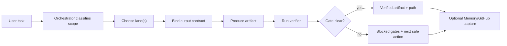

# Deliverable Swarm Operating Overview

Status: active local v1
Scope: Vega / Vivi / LIONCOM / OpenClaw-facing agent work
Source pattern: VRSEN/OpenSwarm, pattern-only
Runtime changes: none

## Kurzbild

The Deliverable Swarm Contract is the user-facing structure layer for agent work.
It answers four questions before a task becomes execution:

- Which lane owns the work?
- Which artifact will be produced?
- Where will the artifact be written?
- Which verifier proves it is usable?

It adopts OpenSwarm's best product pattern, visible specialist lanes, without
adopting OpenSwarm's runtime risks such as auto-installers, broad Composio
integrations, system package mutation, hidden all-to-all handoff, or provider
execution without gates.

## Wo es genutzt wird

| Place | Purpose | File or command |
| --- | --- | --- |
| Source contract | Human-readable contract and hard boundaries | `docs/agent_os/DELIVERABLE_SWARM_CONTRACT.md` |
| Machine contract | Required lanes, metadata and boundaries | `docs/agent_os/DELIVERABLE_SWARM_CONTRACT.json` |
| Implementation | Lane, output-contract and validation logic | `research_agent/ops/deliverable_swarm.py` |
| Agent OS runner | Generates the current review artifacts | `python3 scripts/ops/agent_os_readiness.py` |
| Generated overview | Current lane matrix and output contracts | `outputs/agent_os_readiness/DELIVERABLE_SWARM_CONTRACT.md` |
| Operator Inbox | Shows the review item as P0 deliverable surface | `outputs/agent_os_readiness/OPERATOR_INBOX.md` |
| Automation cards | Adds a safe review card, not an installed automation | `outputs/agent_os_readiness/AUTOMATION_JOB_CARDS.md` |
| Readiness report | Records the OpenSwarm transfer as a local capability | `outputs/agent_os_readiness/AGENT_OS_READINESS_REPORT.md` |
| Tests | Prevents lane, gate, handoff and metadata drift | `research_agent/tests/test_agent_os_deliverable_swarm.py` |
| Canvas | Visual map of when and how to use it | `docs/agent_os/DELIVERABLE_SWARM_OPERATING_MAP.canvas` |

## Wann es genutzt wird

Use it before starting any work that should produce a concrete output:

- a research brief, source matrix or decision memo
- a data analysis, chart, table or quality note
- a markdown, DOCX, PDF, SOP or report document
- a slide deck, pitch deck or visual QA artifact
- an image or video asset behind provider and rights gates
- an operator note, draft message or coordination summary
- a multi-lane package where several outputs must fit together

Use it especially when the task wording is broad, for example "mach alles",
"baue die perfekte Version", "erstelle ein Paket", "analysiere und liefere",
"mach eine Praesentation", or "gib mir alles was ich wissen muss".

## Wann es nicht direkt genutzt wird

Do not use the Deliverable Swarm Contract as permission to:

- install OpenSwarm or another external runtime
- connect Gmail, Slack, GitHub, Stripe, Composio or media providers
- read or import secret values
- no public publishing
- mutate canonical Obsidian notes automatically
- create scheduled-runner agents or automations
- use hidden all-to-all handoff between specialists

Those actions remain behind the External Skill Intake SOP, provider/credential
gates, operator approval and the existing Obsidian promotion rules.

## Wie es funktioniert



The orchestrator may route to every specialist lane. Specialist lanes return to
the orchestrator or to narrow downstream artifact lanes. This gives OpenSwarm's
clarity without turning the runtime into an unbounded mesh.

## Lane Matrix

| Lane | Use when | Outputs | Gate | Verifier |
| --- | --- | --- | --- | --- |
| `orchestrator` | The task needs routing, decomposition or multiple outputs | `route_plan`, `handoff_packet` | local verification | `validate_route_has_lane_owner_output_path_and_gate` |
| `assistant` | The task is operator-facing coordination or a draft | `operator_note`, `draft_message`, `task_summary` | operator-go for irreversible action | `validate_no_irreversible_action_without_operator_go` |
| `research` | The task needs cited facts, comparisons or repo analysis | `research_brief`, `source_matrix`, `decision_options` | local verification | `validate_claims_have_sources_and_open_questions` |
| `data` | The task uses structured data, metrics or charts | `analysis_report`, `chart_asset`, `data_quality_note` | local verification | `validate_inputs_metrics_chart_paths_and_data_limits` |
| `docs` | The final output is a document, SOP, PDF or DOCX | `markdown_doc`, `docx_doc`, `pdf_doc`, `change_summary` | local verification | `validate_source_html_or_markdown_export_and_change_summary` |
| `slides` | The final output is a slide deck or pitch deck | `slide_source`, `pptx_deck`, `deck_visual_qa` | local verification | `validate_deck_export_visual_qa_and_no_overflow` |
| `images` | The task needs image generation or editing | `image_asset`, `image_qc_report` | operator/provider gate | `validate_prompt_reference_rights_output_path_and_qc` |
| `video` | The task needs video generation or editing | `video_asset`, `video_qc_report` | operator/provider gate | `validate_brief_duration_provider_cost_output_path_and_qc` |

## Output Contract

Every final artifact must carry:

- `artifact_id`
- `lane_id`
- `artifact_type`
- `output_path`
- `status`
- `verifier`
- `blocked_gates`
- `next_action`

Allowed final status values:

- `draft`
- `internal_best`
- `verified`
- `blocked`

The important point: a task is not done because an agent wrote prose. It is done
when the artifact path, lane, verifier and gate state are explicit.

## Gate Logic

| Gate | Meaning |
| --- | --- |
| `local_verification_required` | The lane can run locally, but final output still needs verifier evidence. |
| `operator_go_required` | The lane can prepare, but an irreversible action needs explicit approval. |
| `provider_gated_contract` | Image/video/media provider work is contract-only until keys, cost, rights and QC are clear. |
| `blocked` | Missing input, unsafe action, missing verifier or missing gate evidence stops the lane. |

## Standard Operating Sequence

1. Read the request and decide whether it is a deliverable task.
2. Route through `orchestrator` if more than one lane is possible.
3. Select one or more lanes.
4. Bind output contracts before creating artifacts.
5. Write artifacts under `outputs/deliverable_swarm/<lane>/<project>/...` or a project-specific verified path.
6. Run lane verifier or the nearest existing project verifier.
7. Report final path, status, blocked gates and next safe action.
8. If durable project truth changed, capture it in Obsidian or Pending Sync.
9. If repo truth changed, sync through reviewed Git workflow and CI.

## Decision Cheatsheet

| User asks for | Route first to |
| --- | --- |
| "analysiere dieses Repo/Tool" | `research` |
| "mach daraus eine Strategie/Optionen" | `research` + `orchestrator` |
| "analysiere diese Daten/CSV/XLSX" | `data` |
| "erstelle ein Dokument/SOP/Report/PDF" | `docs` |
| "erstelle eine Praesentation/Pitch Deck" | `slides` |
| "erstelle Bild/Mockup/Hero Visual" | `images` with operator/provider gate |
| "erstelle Video/Clip/Animation" | `video` with operator/provider gate |
| "schreib eine Nachricht/Zusammenfassung" | `assistant` |
| "mach alles / perfektes Paket" | `orchestrator` then lane package |

## Visual Map

Open this canvas for the diagram:

- `docs/agent_os/DELIVERABLE_SWARM_OPERATING_MAP.canvas`

The canvas shows:

- when the contract is entered
- how orchestration routes to lanes
- where output contracts sit
- where verifiers and gates stop or finalize work
- which source/output files define the system

## Verification

Current verified command set:

```bash
python3 scripts/ops/agent_os_readiness.py
.venv/bin/python -m pytest -q
.venv/bin/python -m coverage run -m pytest -q
.venv/bin/ruff check .
git diff --check
```

Latest known green state:

- `deliverable_contract_valid=true`
- `deliverable_lanes=8`
- `delivery_contracts=22`
- `automation_cards_valid=true`
- `operator_inbox_valid=true`
- GitHub commit `e95034f`
- GitHub CI run `26196522486` successful

## What To Remember

This is not a new agent runtime. It is the contract that makes our existing
system feel like a coherent specialist team. It should be read before adding
new user-facing agent surfaces, mission packs, output workflows or OpenClaw
migration experiences.
