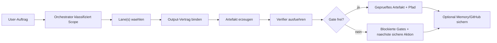

# Deliverable-Swarm-Nutzungsuebersicht

Status: aktive lokale v1
Scope: Vega / Vivi / LIONCOM / OpenClaw-nahe Agentenarbeit
Quellmuster: VRSEN/OpenSwarm, nur als Muster uebernommen
Runtime-Aenderungen: keine

## Kurzbild

Der Deliverable-Swarm-Vertrag ist die sichtbare Struktur fuer Agentenarbeit.
Er beantwortet vor der Ausfuehrung vier Fragen:

- Welche Lane besitzt die Arbeit?
- Welches Artefakt wird geliefert?
- Wohin wird das Artefakt geschrieben?
- Welcher Verifier beweist, dass es nutzbar ist?

Uebernommen wird OpenSwarms gutes Produktmuster: sichtbare Spezialisten-Lanes
fuer konkrete Outputs. Nicht uebernommen werden OpenSwarms Runtime-Risiken wie
Auto-Installer, breite Composio-Integrationen, Systempaket-Mutationen,
versteckte all-to-all-Handoffs oder Provider-Ausfuehrung ohne Gate.

## Wo es genutzt wird

| Ort | Zweck | Datei oder Befehl |
| --- | --- | --- |
| Quellvertrag | Menschlich lesbarer Vertrag und harte Grenzen | `docs/agent_os/DELIVERABLE_SWARM_CONTRACT.md` |
| Maschinenvertrag | Pflicht-Lanes, Metadaten und Grenzen | `docs/agent_os/DELIVERABLE_SWARM_CONTRACT.json` |
| Implementierung | Lane-, Output-Vertrags- und Validierungslogik | `research_agent/ops/deliverable_swarm.py` |
| Agent-OS-Runner | Erzeugt die aktuellen Review-Artefakte | `python3 scripts/ops/agent_os_readiness.py` |
| Generierte Uebersicht | Aktuelle Lane-Matrix und Output-Vertraege | `outputs/agent_os_readiness/DELIVERABLE_SWARM_CONTRACT.md` |
| Operator Inbox | Zeigt den Review-Punkt als P0-Lieferoberflaeche | `outputs/agent_os_readiness/OPERATOR_INBOX.md` |
| Automation Cards | Fuegt eine sichere Review-Karte hinzu, keine installierte Automation | `outputs/agent_os_readiness/AUTOMATION_JOB_CARDS.md` |
| Readiness-Bericht | Dokumentiert den OpenSwarm-Transfer als lokale Faehigkeit | `outputs/agent_os_readiness/AGENT_OS_READINESS_REPORT.md` |
| Tests | Verhindert Drift bei Lanes, Gates, Handoffs und Metadaten | `research_agent/tests/test_agent_os_deliverable_swarm.py` |
| Canvas | Visuelle Karte fuer Wann, Wo und Wie | `docs/agent_os/DELIVERABLE_SWARM_OPERATING_MAP.canvas` |

## Wann es genutzt wird

Nutze den Vertrag vor jeder Arbeit, die ein konkretes Ergebnis liefern soll:

- Research-Brief, Quellenmatrix oder Entscheidungsnotiz
- Datenanalyse, Chart, Tabelle oder Datenqualitaetsnotiz
- Markdown-, DOCX-, PDF-, SOP- oder Report-Dokument
- Slide Deck, Pitch Deck oder visuelles QA-Artefakt
- Bild- oder Video-Artefakt hinter Provider- und Rechte-Gates
- Operator-Notiz, Nachrichtenentwurf oder Koordinationszusammenfassung
- Multi-Lane-Paket, bei dem mehrere Outputs zusammenpassen muessen

Besonders wichtig ist er bei breiten Auftraegen wie "mach alles", "baue die
perfekte Version", "erstelle ein Paket", "analysiere und liefere", "mach eine
Praesentation" oder "gib mir alles was ich wissen muss".

## Wann es nicht direkt genutzt wird

Der Deliverable-Swarm-Vertrag ist keine Erlaubnis fuer:

- OpenSwarm oder eine andere externe Runtime zu installieren
- Gmail, Slack, GitHub, Stripe, Composio oder Media-Provider zu verbinden
- Secrets oder API-Keys zu lesen oder zu importieren
- oeffentliche Veroeffentlichungen auszufuehren
- kanonische Obsidian-Notizen automatisch zu veraendern
- Scheduled-Runner-Agenten oder Automationen anzulegen
- versteckte all-to-all-Handoffs zwischen Spezialisten zu nutzen

Solche Aktionen bleiben hinter External Skill Intake SOP, Provider- und
Credential-Gates, Operator-Go und den bestehenden Obsidian-Promotion-Regeln.

## Wie es funktioniert



Der Orchestrator darf an jede Spezialisten-Lane routen. Spezialisten-Lanes
geben an den Orchestrator oder an eng definierte nachgelagerte Artefakt-Lanes
zurueck. Dadurch entsteht OpenSwarms Klarheit, ohne die Runtime in ein
unbegrenztes Mesh zu verwandeln.

## Lane-Matrix

| Lane | Nutzen, wenn | Outputs | Gate | Verifier |
| --- | --- | --- | --- | --- |
| `orchestrator` | Der Auftrag braucht Routing, Zerlegung oder mehrere Outputs | `route_plan`, `handoff_packet` | lokale Pruefung | `validate_route_has_lane_owner_output_path_and_gate` |
| `assistant` | Der Auftrag ist operatornahe Koordination oder ein Entwurf | `operator_note`, `draft_message`, `task_summary` | Operator-Go fuer irreversible Aktion | `validate_no_irreversible_action_without_operator_go` |
| `research` | Quellenbelegte Fakten, Vergleiche oder Repo-Analyse noetig sind | `research_brief`, `source_matrix`, `decision_options` | lokale Pruefung | `validate_claims_have_sources_and_open_questions` |
| `data` | Strukturierte Daten, Metriken oder Charts genutzt werden | `analysis_report`, `chart_asset`, `data_quality_note` | lokale Pruefung | `validate_inputs_metrics_chart_paths_and_data_limits` |
| `docs` | Das Ergebnis ein Dokument, SOP, PDF oder DOCX ist | `markdown_doc`, `docx_doc`, `pdf_doc`, `change_summary` | lokale Pruefung | `validate_source_html_or_markdown_export_and_change_summary` |
| `slides` | Das Ergebnis ein Slide Deck oder Pitch Deck ist | `slide_source`, `pptx_deck`, `deck_visual_qa` | lokale Pruefung | `validate_deck_export_visual_qa_and_no_overflow` |
| `images` | Bildgenerierung oder Bildbearbeitung noetig ist | `image_asset`, `image_qc_report` | Operator-/Provider-Gate | `validate_prompt_reference_rights_output_path_and_qc` |
| `video` | Videogenerierung oder Videobearbeitung noetig ist | `video_asset`, `video_qc_report` | Operator-/Provider-Gate | `validate_brief_duration_provider_cost_output_path_and_qc` |

## Output-Vertrag

Jedes finale Artefakt muss diese Felder tragen:

- `artifact_id`
- `lane_id`
- `artifact_type`
- `output_path`
- `status`
- `verifier`
- `blocked_gates`
- `next_action`

Erlaubte finale Statuswerte:

- `draft`
- `internal_best`
- `verified`
- `blocked`

Wichtig: Ein Auftrag ist nicht fertig, weil ein Agent Text geschrieben hat. Er
ist fertig, wenn Artefaktpfad, Lane, Verifier und Gate-Zustand explizit sind.

## Gate-Logik

| Gate | Bedeutung |
| --- | --- |
| `local_verification_required` | Die Lane darf lokal laufen, aber der finale Output braucht Verifier-Evidence. |
| `operator_go_required` | Die Lane darf vorbereiten, aber irreversible Aktionen brauchen explizite Freigabe. |
| `provider_gated_contract` | Bild-/Video-/Media-Provider-Arbeit bleibt vertraglich, bis Keys, Kosten, Rechte und QC klar sind. |
| `blocked` | Fehlender Input, unsichere Aktion, fehlender Verifier oder fehlende Gate-Evidence stoppt die Lane. |

## Standard-Ablauf

1. Auftrag lesen und entscheiden, ob ein konkretes Lieferobjekt noetig ist.
2. Ueber `orchestrator` routen, wenn mehrere Lanes moeglich sind.
3. Eine oder mehrere Lanes waehlen.
4. Output-Vertraege binden, bevor Artefakte erzeugt werden.
5. Artefakte unter `outputs/deliverable_swarm/<lane>/<project>/...` oder einem projektspezifisch geprueften Pfad schreiben.
6. Lane-Verifier oder naechsten bestehenden Projekt-Verifier ausfuehren.
7. Finalen Pfad, Status, blockierte Gates und naechste sichere Aktion berichten.
8. Wenn dauerhafte Projektwahrheit entstanden ist, in Obsidian oder Pending Sync sichern.
9. Wenn Repo-Wahrheit entstanden ist, ueber Review-Git-Workflow und CI sichern.

## Entscheidungs-Spickzettel

| User fragt nach | Zuerst routen zu |
| --- | --- |
| "analysiere dieses Repo/Tool" | `research` |
| "mach daraus eine Strategie/Optionen" | `research` + `orchestrator` |
| "analysiere diese Daten/CSV/XLSX" | `data` |
| "erstelle ein Dokument/SOP/Report/PDF" | `docs` |
| "erstelle eine Praesentation/Pitch Deck" | `slides` |
| "erstelle Bild/Mockup/Hero Visual" | `images` mit Operator-/Provider-Gate |
| "erstelle Video/Clip/Animation" | `video` mit Operator-/Provider-Gate |
| "schreib eine Nachricht/Zusammenfassung" | `assistant` |
| "mach alles / perfektes Paket" | `orchestrator`, danach Lane-Paket |

## Visuelle Karte

Oeffne diese Canvas-Datei fuer das Schaubild:

- `docs/agent_os/DELIVERABLE_SWARM_OPERATING_MAP.canvas`

Die Canvas zeigt:

- wann der Vertrag greift
- wie Orchestrierung in Lanes routet
- wo Output-Vertraege sitzen
- wo Verifier und Gates stoppen oder finalisieren
- welche Quell- und Output-Dateien das System definieren

## Verifikation

Aktuell gepruefte Befehle:

```bash
python3 scripts/ops/agent_os_readiness.py
.venv/bin/python -m pytest -q
.venv/bin/python -m coverage run -m pytest -q
.venv/bin/ruff check .
git diff --check
```

Letzter bekannter gruener Stand:

- `deliverable_contract_valid=true`
- `deliverable_lanes=8`
- `delivery_contracts=22`
- `automation_cards_valid=true`
- `operator_inbox_valid=true`
- GitHub-Commit `d49ce27`
- GitHub-CI-Lauf `26197182784` erfolgreich

## Merken

Das ist keine neue Agenten-Runtime. Es ist der Vertrag, der unser bestehendes
System wie ein klares Spezialisten-Team benutzbar macht. Er soll gelesen werden,
bevor neue sichtbare Agentenoberflaechen, Mission Packs, Output-Workflows oder
OpenClaw-Migrationserfahrungen gebaut werden.
