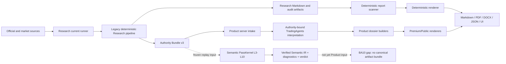

# Current State Dataflow

## Two real paths, not one completed compiler cutover

The semantic compiler is executable and frozen, but remains a compatibility
shadow. The current Product runtime does not yet consume its verified compile
state as one canonical output.

## Current edges

| # | Producer | Consumer | Contract / interface | File or API surface | Owner | Transform | Fachliche logic | Hash/version state | Current truth owner |
|---|---|---|---|---|---|---|---|---|---|
| 1 | User/app intake | Research current runner | symbol/date/options | `research_agent/current/runner.py`, `python -m research_agent.current` | Research | identity resolution, capability and jurisdiction checks | yes | run manifest; not the future ABI | Research |
| 2 | Research adapters | legacy Research pipeline | provider records and source snapshots | `research_agent/current/runner.py`, adapter modules | Research | acquisition, normalization, cutoff and scope checks | yes | source IDs, retrieval metadata and hashes | Research |
| 3 | Legacy Research pipeline | canonical Research artifacts | internal JSON/Markdown contracts | `research_agent/run_pipeline.py` | Research | reconciliation, metrics, evidence, claims, decisions, validation | yes | artifact hashes and manifests; multiple contracts | Research |
| 4 | Research pipeline | Authority Bundle v3 | `room16.research_authority_bundle@3` | `research_agent/integration/authority_bundle.py` | Research | packages validated facts, evidence, decisions and context | yes, as compatibility packaging and validation | versioned manifest and SHA-256 | Research |
| 5 | Research pipeline | legacy Research report surfaces | report/audit Markdown | `final_report.md`, `publish_report.md`, `internal_best_report.md` | Research | composition and reader-facing wording | mixed | output manifest hashes | Research, but presentation is not isolated |
| 6 | Frozen Authority-v3 candidate | semantic compiler | RFC-0004 compile input | `research_agent/semantic_compiler/semantic_spine/rfc_0004.py` | Research | Parse→Normalize→Facts→Metrics→Evidence→Claims→Decision→Verify | yes | PassKernel content hashes, semantic registry lock, verification IR | Research shadow |
| 7 | Semantic PassKernel | semantic compile state | `room16.compiler.semantic_compile_state_ir@2` and child IRs | `rfc_0004_contracts.py` | Research | deterministic pass execution and verification | yes | content-addressed, replayable | Research shadow |
| 8 | Product server | Research current runner | subprocess plus Authority-v3 directory | `room16-app/server.mjs` | Product runtime | orchestration and queue state | no, if kept operational only | exact ticker/date and manifest validation | Research for semantics |
| 9 | Authority Bundle v3 | Product JS intake | manual JS v3 interpretation | `server-modules/research-authority-bundle.mjs` | Product | schema and semantic validation | mixed; duplicates Research rules | v3 and hashes | duplicate Product truth exists |
| 10 | Authority Bundle v3 | Product Python intake | manual Python v3 interpretation | `room16/core/research_authority.py` | Product | schema, hash, permission and semantic validation | mixed; duplicates Research rules | v3 and hashes | duplicate Product truth exists |
| 11 | Authority Bundle v3 | TradingAgents | `research_authority_context` | `scripts/bcr_company_batch.py` | Product | creates bounded interpretation context | yes, interpretive only | authority identity captured | Research remains factual owner |
| 12 | TradingAgents graph | Product interpretation packet | `room16.authority_interpretation@1` | `room16/core/interpretation_contract.py` | Product | bull/bear/risk narrative and debate | semantic annotation | packet hash; `toolCallsAllowed=false` | non-authoritative annotation |
| 13 | Research report + Authority v3 | deterministic scanner | Product snapshot contract | `server-modules/deterministic-research-report.mjs` | Product | rescans claims, appendix and completeness | mixed duplicate validation | `room16.deterministic_report_snapshot@4` | duplicate Product truth exists |
| 14 | Research Markdown | deterministic renderer | Markdown input | `scripts/room16_render_deterministic_report.py` | Product | DOCX/PDF layout and parity checks | mostly presentation; specificity gate is mixed | report hash, render checks | mixed |
| 15 | Authority + interpretation | dossier builder | Product internal records | `scripts/room16_build_complete_dossier.py` | Product | section selection, rewriting, risk selection, language cleanup | yes | fragmented manifests | Product semantic transform |
| 16 | Product records | premium/public renderer | Product report contracts | `scripts/room16_build_premium_report.py` and related renderer scripts | Product | prose assembly, localization, DOCX/PDF | mixed | render and report manifests | mixed |
| 17 | Product runtime | UI/API | job/snapshot/report JSON | `room16-app/server.mjs`, UI routes | Product | lifecycle, links, visibility | no if semantic status is consumed, not derived | runtime IDs and snapshot hashes | Product operational owner |
| 18 | Research registries | Product mirror verifier | read-only mirror manifests | `config/room16_*registry_mirror*`, mirror verifier scripts | Research contract; Product consumer | generic hash/schema conformance | no | authoritative hash and version lock | Research |

## Artifacts produced by current L0–L10 semantic replay

The accepted RFC-0004 path binds these artifact classes into the compile state:

- L0–L2 input/source identity, snapshots, parsed payload and table artifacts;
- normalized record and typed fact IR;
- metric instances, formula operands/evaluations and policy parameters;
- complete evidence graph with source, locator, parsed, table, cell,
  normalized, fact, metric and formula nodes;
- claim graph and complete claim→fact→evidence→source→locator lineage;
- lossless and registry-semantic decision graph;
- pass execution records and execution attestation;
- L10 Verification Report, DiagnosticIR records and CompileVerdictIR;
- registry lock, pass manifest hash and implementation/IR source bindings.

They are not yet emitted as a single Product-consumable ABI.

## Fragmented current Product inputs and outputs

Product currently sees Authority Bundle v3, legacy Research Markdown, source
registry and evidence attachments, optional interpretation packets, Product
quality/status records and several snapshot/render manifests. Output surfaces
include Markdown, JSON, API/UI payloads, DOCX and PDF. These contracts overlap;
none is the sole compiler artifact.

## Outputs that may disappear after proven migration

The following can be retired only after shadow parity and negative-fixture
coverage, not deleted immediately:

- independent Python and JavaScript semantic re-validations of Authority v3;
- Product metric definitions and formula checks;
- Product claim/evidence/decision semantic validators;
- Product-generated semantic status or rating derivation;
- dossier cleanup rules that correct facts or infer meaning;
- duplicate canonical report/snapshot manifests whose only purpose is to
  reconstruct semantic identity already present in the compiler bundle;
- raw Authority-v3 transport as a Product entry point after all consumers use
  its compatibility view from the canonical bundle.

Operational job state, human/legal/publication gates, commerce/delivery state
and render artifact manifests remain Product-owned because they are not
financial research truth.

